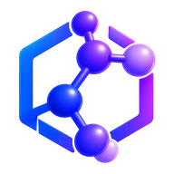

<div align="center">



# ANALOG

**A molecular design workbench where the chemistry is computed, not recalled.**

Design drug analogs alongside an AI agent — and check every number it gives you
against RDKit, running locally in your browser.

[Why it exists](#why-it-exists) · [What it does](#what-it-does) ·
[Getting started](#getting-started) · [How it works](#how-it-works) ·
[For agents](#for-agents)

</div>

---

## Why it exists

Ask a language model for a molecular weight and a predicted aqueous solubility.
It will give you both, in the same tone, with the same confidence.

One of those is addition. The other is a regression fitted to measured data with
roughly a log unit of error in either direction. The model does not distinguish
between them, and neither does its output.

That gap is not an edge case in AI-assisted chemistry — it *is* the problem.
A model that is fluent about chemistry will produce plausible numbers for
molecules nobody has ever made, and plausible is indistinguishable from correct
right up until someone orders the reagents.

**ANALOG is built around closing that gap.** An agent proposes; RDKit measures;
you decide. Every value on every screen is labelled with how it was arrived at.
And when the agent commits to a number *before* the oracle runs, the app keeps
score — so you find out whether its chemical intuition is any good, from evidence
rather than vibes.

> The agent brings fluency and breadth. The workbench brings arithmetic and a
> memory of who was right. Neither is much use without the other.

### The three ideas underneath it

**Never blur claimed and measured.** Properties carry a confidence tier: *exact*
(counted from the structure), *computed* (a published algorithm), *estimated*
(a regression, with its error bar shown). Predictions the agent makes are scored
against reality and kept in a running ledger. Reports let the agent write the
judgement, while the app writes every number in them — so a recalled figure can
never reach a document going out under your name.

**The human holds the gate.** An agent can only ever *propose*. Accepting a
candidate, promoting one to focus, fetching 3D coordinates, downloading a report
— all human acts, and no tool can reach them. The agent is a collaborator with
opinions, not an autonomous pipeline.

**Refuse rather than guess.** Binding affinity, potency, toxicity, pKa,
synthetic routes: asked for any of these, the app returns a refusal explaining
why, not a number. A plausible figure with nothing behind it is worse than no
figure at all.

---

## What it does

### Design analogs with an agent in the loop

Set a focus molecule and a brief — a goal in plain words, numeric constraints,
and any functional group that must survive. The agent proposes analogs; each one
arrives measured, ranked, and labelled with *why* it is interesting: **best
balance**, **best solubility**, **best 3D diversity**, **alternate scaffold**.

Cards answer one question — *is this worth opening?* Everything else lives one
click away in the inspector.

### Real chemistry, computed locally

RDKit compiled to WebAssembly runs in your browser. No molecule is uploaded to
compute anything.

| | |
|---|---|
| **Descriptors** | MW, logP, TPSA, HBD/HBA, rotatable bonds, rings, Fsp³ |
| **Solubility** | ESOL estimate with its error bar and a mg/L conversion |
| **Drug-likeness** | Lipinski, Veber, Egan, Pfizer 3/75 — each naming the clause that failed |
| **Absorption** | HIA, oral bioavailability, BBB penetration, P-gp efflux, net brain penetration |
| **Metabolism** | Hepatic stability, half-life band, CYP3A4/2D6/2C9 likelihood |
| **Synthesis** | Synthetic accessibility (Ertl), with complexity drivers |
| **Structure** | Functional groups, structural alerts, toxicity patterns, bioisostere suggestions |
| **Similarity** | Morgan fingerprints, Tanimoto, board diversity |
| **Shape** | NPR1/NPR2/span from real 3D coordinates |

### Six workspaces, each with one job

- **Overview** — what is blocking you, and whether the design is converging on
  your brief
- **Design** — the main board: focus molecule, brief, ranked candidates
- **Explore** — everything ever proposed, filtered by status, generation,
  ruleset or synthesizability
- **Compare** — two to five molecules side by side, with deltas, a profile radar
  and written insights
- **Evolution** — the design tree as a graph, with the promoted path as its
  spine, plus how the board converged
- **Report** — a document the agent drafts and you publish

### Reports that cannot lie about numbers

Ask for one in plain language. The agent chooses the sections and writes the
narrative; **the app renders every property, table, structure and chart from
live state.** Sections reference molecules by id — the agent never types a value
into the document.

Download as a PDF (via the browser's own typesetter), a self-contained HTML file
with structures inlined, or Markdown. 2D structures are vector, so they stay
sharp at any size; 3D structures can be rendered and embedded on request.

---

## Getting started

```bash
cd danlog_app
npm install
npm run dev
```

Then open the URL it prints.

The first load fetches RDKit's WebAssembly build (~7 MB) and caches it. A
starting molecule is loaded for you, so there is something on the board
immediately.

### Connecting an agent

The agent surface uses **WebMCP** (`document.modelContext`), an experimental
browser API for exposing page functionality to AI agents.

- **Chrome:** enable `chrome://flags/#enable-webmcp-testing` and relaunch
- **Agent browsers:** may support it natively

Without it, everything except the agent still works — you can design by hand.
The developer trace in the top bar tells you exactly what is missing and why.

---

## How it works

```
                     you
                      │  brief: goal, constraints, group to preserve
                      ▼
   ┌──────────  focus molecule  ──────────┐
   │                                       │
   │  agent proposes  ──►  RDKit measures  │
   │        │                    │         │
   │        └──►  ranked candidates  ◄─────┘
   │                     │
   │            inspect · compare
   │                     │
   │                you decide
   │                     │
   └────────  make focus molecule  ─── new generation
```

### Built with

React 19 · TypeScript · Vite · Zustand · **RDKit** (WebAssembly) ·
**3Dmol.js** · **React Flow** + **d3-hierarchy** · WebMCP

No CSS framework, no charting library — the radar, line charts and sparklines
are hand-written SVG, because two shapes did not justify three hundred
kilobytes.

### What leaves your machine

Everything is computed locally, with two exceptions — both optional, both to
public NIH services, both stated plainly in-app:

| | Why | Optional |
|---|---|---|
| **3D coordinates** | RDKit's browser build cannot generate conformers | Only fetched when you view a structure in 3D |
| **Systematic names** | IUPAC naming is a rule engine that does not ship to WASM | Toggle in Settings |

Your session lives in `localStorage` as SMILES and decisions only. Everything
else is recomputed on load, so a change to how a property is calculated can
never leave a stale number behind.

---

## For agents

Twelve tools are registered on the document:

| Tool | |
|---|---|
| `get_workbench_state` | The board, the brief, and how your predictions are doing |
| `get_molecule_properties` | Full descriptor set for any SMILES |
| `analyse_structure` | Functional groups, alerts, toxicity patterns |
| `check_substructure` | SMARTS matching |
| `suggest_bioisosteres` | Replacements for groups actually present |
| `compare_molecules` | Side-by-side with similarity |
| `get_3d_shape` | Shape descriptors, where coordinates exist |
| `propose_candidate` | Add an analog — **scores your prediction against reality** |
| `set_focus_molecule` | Promote an already-accepted candidate |
| `get_computable_limits` | What this app refuses to estimate, and why |
| `draft_report` | Draft a report for the human to edit and publish |
| `clear_report` | Discard the draft |

Two conventions worth knowing if you are building on this:

**Every failure carries a hint.** We do not own the model on the other end, so
the response text is the only steering available. A tool that returns a stack
trace leaves an agent stuck; one that returns a code and a next step lets it fix
itself and retry.

**Predictions are invited, then checked.** `propose_candidate` asks for your
expected MW, logP and TPSA *before* it computes them, returns the error on each,
and remembers. That feedback loop is the point.

---

## Project layout

```
danlog_app/
├── src/
│   ├── chem/      the chemistry: RDKit, rules, estimators, ranking, reports
│   ├── mcp/       the WebMCP tool surface
│   ├── store/     Zustand board state — reachable by tools, not just React
│   ├── pages/     Overview · Design · Explore · Compare · Evolution · Report
│   └── ui/        shared components, charts, the inspector, exporters
├── brand/         logo sources; public/ carries the downscaled versions
└── public/        RDKit and 3Dmol bundles, icons
```

Board state deliberately lives in a plain Zustand store rather than React state
or context: a WebMCP tool call arrives from outside React and has to be able to
read and write the board.

---

## Status

Working, and honest about its own limits. WebMCP is an early-stage proposal at
the W3C Web Machine Learning Community Group, so the agent surface will move as
the specification does.

The estimators here are literature methods, not trained models. They are useful
for ranking and direction of travel — they are not a substitute for measurement,
and the app says so wherever it shows one.

## Licence

MIT © 2026 Kumar — see [LICENSE](LICENSE).
